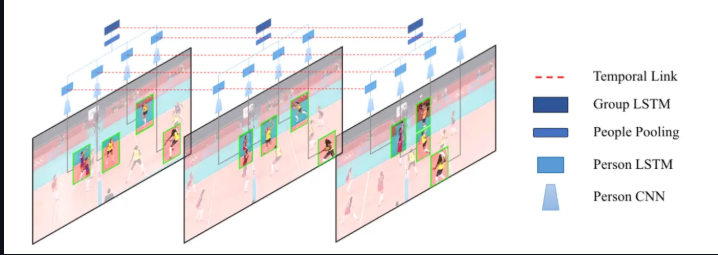
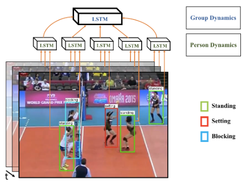
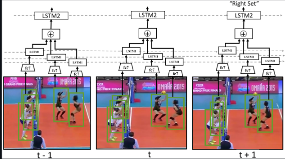
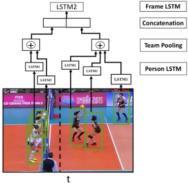
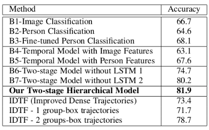

# A Hierarchical Deep Temporal Model for Group Activity Recognition

**Based on the CVPR 2016 paper by Mostafa S. Ibrahim, Srikanth Muralidharan, Zhiwei Deng, Arash Vahdat, and Greg Mori.**

---

## 📖 Introduction & Problem Description

When watching a sports game, how do we know what play a team is executing? We usually figure out the **whole team's activity** by observing the **actions of individual players** over time. 

This project solves the problem of **Group Activity Recognition** by building a deep learning model that mimics this exact human logic. We introduce a **2-stage deep temporal model** powered by Long Short-Term Memory (LSTM) networks:
1. **Stage 1 (Person-Level):** An LSTM model is designed to represent the dynamic actions of individual people in a sequence.
2. **Stage 2 (Group-Level):** A second LSTM model aggregates this individual person-level information to understand the entire scene's activity.

*Figure 1: A high-level look at our hierarchical model. Each person's movement is tracked individually to capture their dynamics, and these models are then integrated into a higher-level network to recognize the full scene's activity.*

---

## 🧠 How the Architecture Works

Our model is designed to be highly intuitive. Here is a simple breakdown of how data flows through the architecture:

### 1. Capturing Dynamics
[cite: 2]
*Figure 2: We separate the problem into two distinct parts—understanding individual person dynamics (like a player setting or standing) and understanding the overarching group dynamics.*[cite: 2]

### 2. The Detailed Pipeline
[cite: 3]
*Figure 3: The step-by-step process. First, we feed individual player tracklets into a Convolutional Neural Network (CNN), followed by a Person-level LSTM (LSTM 1) to understand what each player is doing. We then pool everyone's features together and feed them into a second Group-level LSTM (LSTM 2) to classify the final team activity (e.g., identifying a "Right Set").*[cite: 3]

### 3. Adding Spatial Awareness
[cite: 4]
*Figure 4: Where players are located on the court matters! While basic models drop spatial information, our updated model uses a 2-group pooling strategy to capture the spatial arrangements and formations of the players.*

---

## 🏐 The Expanded Volleyball Dataset

To train and evaluate our model, we collected a massive new **Volleyball Dataset** using publicly available YouTube videos. This expanded version is **3 times larger** than our original CVPR submission!

* **Total Videos:** 55 videos (8 videos are 1920x1080 resolution, the rest are 1280x720).
* **Total Frames:** 4,830 handpicked annotated frames (3,493 for training, 1,337 for testing).
* **Train/Test Split:** Performed strictly at the *video level* (not frame level) to ensure the model's evaluation is convincing and prevents data leakage.
    * **Train Videos:** 1, 3, 6, 7, 10, 13, 15, 16, 18, 22, 23, 31, 32, 36, 38, 39, 40, 41, 42, 48, 50, 52, 53, 54
    * **Validation Videos:** 0, 2, 8, 12, 17, 19, 24, 26, 27, 28, 30, 33, 46, 49, 51
    * **Test Videos:** 4, 5, 9, 11, 14, 20, 21, 25, 29, 34, 35, 37, 43, 44, 45, 47

### 🏷️ Labels & Classes
We labeled the data at both the team and individual levels:
* **8 Group Activity Classes:** Right set (644), Right spike (623), Right pass (801), Right winpoint (295), Left winpoint (367), Left pass (826), Left spike (642), Left set (633).
* **9 Individual Action Classes:** Waiting (3601), Setting (1332), Digging (2333), Falling (1241), Spiking (1216), Blocking (2458), Jumping (341), Moving (5121), Standing (38696).

### 📁 Directory Structure & Format
* The dataset is organized into folders by unique Video IDs (`0` to `54`).
* Inside each video directory, frames are grouped by the target frame ID (e.g., `volleyball/39/29885`).
* Because scenes change rapidly in volleyball, each frame directory contains a tight window of **41 images** (20 images before the target frame, the target frame itself, and 20 after). *Note: In our work, we specifically used 5 frames before and 4 frames after.*
* **Annotations:** Stored in an `annotations.txt` file per video. 
    * Format: `{Frame ID} {Frame Activity Class} {Player Annotation 1} {Player Annotation 2} ...`
    * Player Annotation Format: `{Action Class} X Y W H` (tight bounding box).

### 🔗 Downloads & Updates
* **[Main Dataset Download Link](https://drive.google.com/drive/folders/1rmsrG1mgkwxOKhsr-QYoi9Ss92wQmCOS)** *(Combined Google Drive folder).*
* **Update 1 (Trajectories):** Extracted player trajectories (generated via Dlib Tracker) are now available to save you processing time.
* **Update 2 (Detectors):** Two Faster-RCNN detectors trained by Jiawei (Eric) He for person and action detection are provided to help speed up custom pipelines. 
* **Update 3 (Manual Annotations):** Manual trajectory annotations kindly provided by Norimichi Ukita. *(Please cite Sendo & Ukita, MVA 2019 if used).*
* **Update 4 (Ball Locations):** Manual ball location annotations provided by Mauricio Perez. *(Please cite their Skeleton-based relational reasoning paper if used).*

---

## 📊 Results & Performance

Our Two-stage Hierarchical Model was rigorously tested and significantly outperforms standard baselines.

[cite: 5]
*Table 1: A comparison of team activity recognition performance on the Volleyball Dataset. Our Two-stage Hierarchical Model achieves a leading accuracy of **81.9%**, successfully outperforming basic image/person classification methods and Improved Dense Trajectories (IDTF) approaches.*[cite: 5]

---
*Note: The first version of this work was accepted at CVPR 2016. The provided dataset is the expanded version. Please use and compare against this version.*