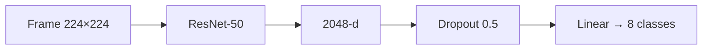
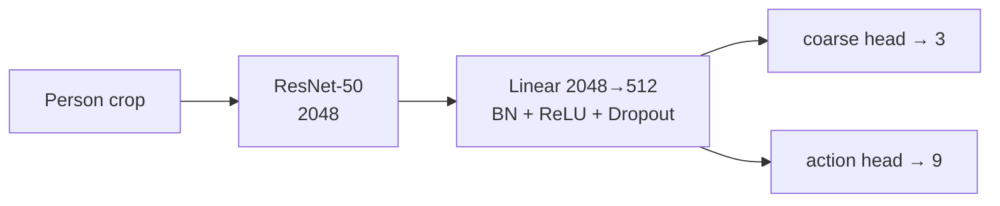
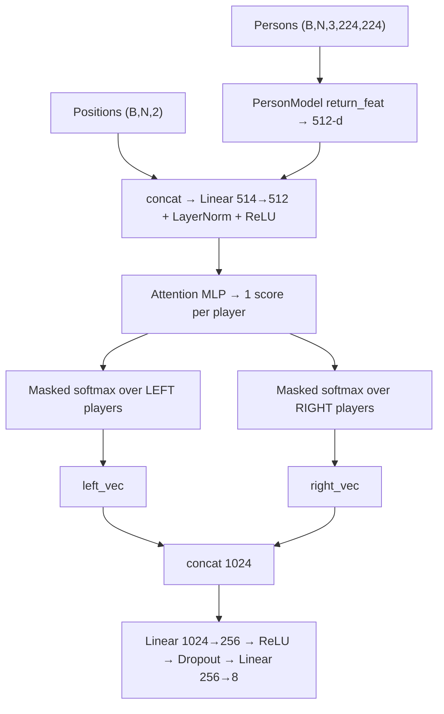
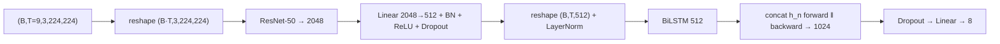
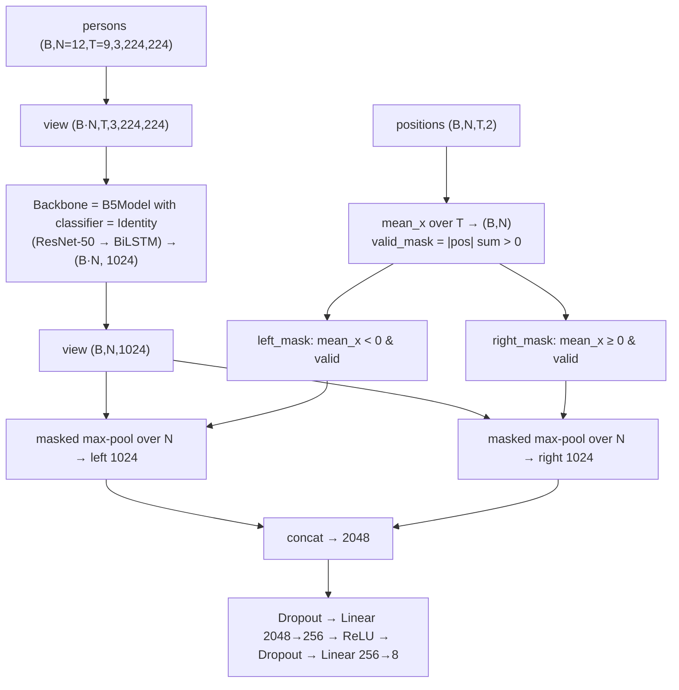

# 🏐 A Hierarchical Deep Temporal Model for Group Activity Recognition

> **An end-to-end PyTorch implementation and modern extension of the CVPR 2016 paper by Mostafa S. Ibrahim, Srikanth Muralidharan, Zhiwei Deng, Arash Vahdat, and Greg Mori.**

---

## Table of Contents

1. [Introduction & Problem Overview](#1-introduction--problem-overview)
2. [Results at a Glance](#2-results-at-a-glance)
3. [Dataset Specifications](#3-dataset-specifications)
4. [Project Structure](#4-project-structure)
5. [Data Pipeline (Layer by Layer)](#5-data-pipeline-layer-by-layer)
6. [Baselines in Detail (B1, B3, B4, B5)](#6-baselines-in-detail)
7. [Training Framework](#7-training-framework)
8. [Design Patterns Used](#8-design-patterns-used)
9. [Performance & Engineering Optimizations](#9-performance--engineering-optimizations)
10. [HPC / Slurm Infrastructure](#10-hpc--slurm-infrastructure)
11. [Getting Started](#11-getting-started)
12. [Known Issues & Tuning Notes](#12-known-issues--tuning-notes)
13. [Roadmap](#13-roadmap)
14. [Citations](#14-citations)

---

## 1. Introduction & Problem Overview

Recognizing group activity in multi-agent sports scenes such as volleyball requires modeling two levels of behavior at the same time:

1. **Individual person dynamics** — what each player is doing over time (spiking, setting, jumping, blocking, falling, ...).
2. **Collective group dynamics** — how the individual behaviors and the players' positions on the court combine into a team-level activity such as **Right Set**, **Left Spike**, or **Right Winpoint**.

This repository implements a **progressive benchmark**. It starts from a single-frame classifier (B1) and moves step by step toward hierarchical spatio-temporal networks (B3 → B4 → B5 → …). Each step adds one new idea, so the effect of every idea can be measured on its own:

| Step | New idea added | Question it answers |
|---|---|---|
| B1 | Whole-scene CNN | How far can one frame go? |
| B3 | Person-level model + spatial/attention pooling | Does looking at individual players help? |
| B4 | Temporal modeling of the whole frame (BiLSTM) | Does time help when we still look at the whole scene? |
| B5 | Temporal modeling of each player's tracklet + court-side pooling | Does combining *person*, *time* and *court side* help? |

<p align="center">
  
  <br>
  <em>Figure 1 — High-level hierarchical architecture. Individual dynamics are tracked temporally, then aggregated into a higher-level scene network.</em>
</p>

### 1.1 Person vs. Group Temporal Dynamics

<p align="center">
  
  <br>
  <em>Figure 2 — Decoupled modeling of atomic person actions and high-level team activity.</em>
</p>

- **Person level:** learn a temporal representation of each player's action.
- **Group level:** aggregate the information of many players to recognize the collective activity.

### 1.2 End-to-End Hierarchical Pipeline

<p align="center">
  
  <br>
  <em>Figure 3 — Feature extraction from player tracklets, person-level LSTM (LSTM 1), pooling over participants, and final activity classification via group-level LSTM (LSTM 2).</em>
</p>

```text
Player Tracklets
      ↓
CNN Feature Extraction
      ↓
Person-Level LSTM (LSTM 1)
      ↓
Spatial / Participant Pooling
      ↓
Group-Level LSTM (LSTM 2)
      ↓
Group Activity Classification
```

### 1.3 Spatial Court-Aware Pooling

<p align="center">
  
  <br>
  <em>Figure 4 — Dividing players by court side (left vs. right) to preserve court formation geometry before temporal aggregation.</em>
</p>

Instead of treating the players as an unordered set, the model uses normalized player coordinates to split them into the two court sides. This keeps useful information about team formation, which matters because every group activity is *side specific* (`l_*` vs `r_*`).

---

## 2. Results at a Glance

| Baseline | Architecture / Pipeline Summary | Original Paper Accuracy | Our Implementation |
|:---|:---|---:|---:|
| **B1-Tuned** | ResNet-50 fine-tuned on middle frame (whole scene) | 66.7% | **70.0% Acc** |
| **B3** | Multi-task Person Model → Spatial Position + Left/Right Attention Pooling | 68.1% | **83.0% Macro F1** |
| **B4** | 9-Frame Sequence → ResNet-50 → BiLSTM Frame Model | 63.1% | **82.2% Macro F1** |
| **B5** | Tracklet-level BiLSTM → 2-Court Max Pooling → Group Classifier | 67.6% | **87.0% Macro F1** |
| **B6** | Frame-by-frame person pooling → Sequence LSTM | 74.7% | *In Progress* |
| **B7** | Full Two-Stage Model (Player LSTMs → Global Pool → Group LSTM) | 80.2% | *In Progress* |
| **B8** | Full Two-Stage Model (Player LSTMs → 2-Team Spatial Pool → Group LSTM) | 81.9% | *In Progress* |

> **Note on metrics:** the paper reports **accuracy**, while our B3/B4/B5 numbers are **macro F1**. Macro F1 is stricter on minority classes, but the two numbers are not directly interchangeable. The best-checkpoint criterion in all trainers is validation macro F1.

---

## 3. Dataset Specifications

The project uses the expanded **Volleyball Dataset** (downloaded from Kaggle: `sherif31/group-activity-recognition-volleyball`).

### 3.1 Scale

- **55 video matches**
- **4,830 annotated keyframes** across the 55 videos
- Split at the **video level** so that clips from the same match never appear in two splits (prevents leakage).

### 3.2 Train / Validation / Test Split

| Split | #Videos | Video IDs |
|---|---:|---|
| Train | 24 | `1, 3, 6, 7, 10, 13, 15, 16, 18, 22, 23, 31, 32, 36, 38, 39, 40, 41, 42, 48, 50, 52, 53, 54` |
| Validation | 15 | `0, 2, 8, 12, 17, 19, 24, 26, 27, 28, 30, 33, 46, 49, 51` |
| Test | 16 | `4, 5, 9, 11, 14, 20, 21, 25, 29, 34, 35, 37, 43, 44, 45, 47` |

### 3.3 Temporal Sampling

Each labeled keyframe has a window of **41 raw frames** centered on it:

```text
t - 20  ...  t - 1  [ t ]  t + 1  ...  t + 20
```

The sequence models in this repository use **9 frames** centered on the target frame:

```text
t - 4  ...  t - 1  [ t ]  t + 1  ...  t + 4
```

For the **tracking annotations** (B5), each player's tracklet contains **20 frames** around the keyframe. We slice `[5:14]` which gives 9 frames centered on the middle of the tracklet (index 9).

### 3.4 Video Resolution

Videos `2, 37, 38, 39, 40, 41, 44, 45` are **1920 × 1080**. All others are **1280 × 720**. Because of this, player positions are always **normalized by the image width/height** (see §5.4).

### 3.5 Class Cardinality

**8 group activities**

| Group Activity | Count |
|---|---:|
| Right set | 644 |
| Right spike | 623 |
| Right pass | 801 |
| Right winpoint | 295 |
| Left winpoint | 367 |
| Left pass | 826 |
| Left spike | 642 |
| Left set | 633 |

**9 atomic (person) actions**

| Atomic Action | Count |
|---|---:|
| Waiting | 3,601 |
| Setting | 1,332 |
| Digging | 2,333 |
| Falling | 1,241 |
| Spiking | 1,216 |
| Blocking | 2,458 |
| Jumping | 341 |
| Moving | 5,121 |
| Standing | 38,696 |

> **Imbalance:** `Standing` is more than 55% of all person boxes. This is handled by `person_collate` (§5.5) and by the loss functions (Focal Loss / multitask loss) used in the run scripts.

### 3.6 Annotation Formats Used

**`videos/<vid>/annotations.txt`** — one line per keyframe:

```text
<frame>.jpg  <group_label>  x y w h <action>  x y w h <action>  ...
```

Each player is described by 5 tokens (`x y w h action`). Labels such as `r-set` are normalized to `r_set` by the `LABEL_FIX` dictionary.

**`volleyball_tracking_annotation/<vid>/<clip>/<clip>.txt`** — one line per (player, frame):

```text
track_id xmin ymin xmax ymax frame_id flag1 flag2 flag3 action
```

---

## 4. Project Structure

```text
volleyball_project/
│
├── configs/                         # Hyperparameter & runtime configurations (.yaml)
│
├── dataset/
│   ├── adapters/                    # Template-method dataset adapters
│   │   ├── base_adapter.py          # BaseAdapter (skeleton + image cache)
│   │   ├── frame_adapter.py         # Whole-frame samples          → B1
│   │   ├── group_adapter.py         # All person crops of a frame  → B3 group model
│   │   ├── person_adapter.py        # One person crop per sample   → B3 person model
│   │   ├── Clip_Adapter.py          # 9-frame whole-scene clip     → B4
│   │   ├── tracking_adapter.py      # One player tracklet          → B5 stage 1
│   │   └── TrackingGroupAdapter.py  # All tracklets of a clip      → B5 stage 2
│   │
│   ├── raw_dataset.py               # Raw frame-level annotation parsing
│   ├── tracking_raw_dataset.py      # Raw single-player tracklet parsing
│   ├── TrackingGroupRawDataset.py   # Raw clip-level (multi-player) parsing
│   ├── collect.py                   # Custom collate functions
│   ├── data_loader.py               # DataLoader builder
│   └── transforms.py                # Paired train/val transforms
│
├── models/
│   ├── backbones/resnet50.py        # Feature extractor
│   ├── baseline_model1/baseline1.py # Whole-scene classifier
│   ├── baseline_model3/baseline3.py # PersonModel + attention GroupModel
│   ├── baseline_model4/baseline4.py # Frame-sequence BiLSTM
│   └── baseline_model5/
│       ├── baseline5.py             # Person tracklet BiLSTM (B5Model)
│       └── GroupBaselineModel.py    # Court-side pooling group model
│
├── trainers/
│   ├── base_trainer.py              # Single-GPU BaseTrainer (AMP, hooks)
│   ├── DDP_base_trainer.py          # Multi-GPU BaseTrainer (all-reduce / all-gather)
│   ├── person_trainer.py            # Multi-task trainer
│   └── group_trainer.py             # Dict-input trainers (single GPU & DDP)
│
├── utils/label_maps.py              # PERSON_ACTION_TO_IDX, GROUP_ACTION_TO_IDX
├── runs/                            # Training entry points (one folder per baseline)
├── run_volleyball.sh                # Slurm single-GPU script
└── run_volleyball_ddp.sh            # Slurm multi-GPU (torchrun) script
```

---

## 5. Data Pipeline (Layer by Layer)

The data side is split into **four independent layers**. Each layer has one job, so changing one (for example a new augmentation) never forces a change in the others.


### 5.1 Raw Datasets — *"what is in the files?"*

Raw datasets only **parse text and build file paths**. They never open images and never produce tensors.

| Class (file) | One sample is… | Used by |
|---|---|---|
| `VolleyballRawDataset` (`raw_dataset.py`) | `{"img": path, "label": group_label, "ann": [tokens...]}` — one keyframe with all its player boxes | B1, B3, B4 |
| `TrackingRawDataset` (`tracking_raw_dataset.py`) | `{video_id, clip_id, track_id, frames[20], boxes[20], label}` — **one player tracklet**. The label is the action at the **middle frame** (`len//2`) | B5 stage 1 |
| `TrackingRawDataset` (`TrackingGroupRawDataset.py`) | `{video_id, clip_id, group_label, players:[{track_id, frames, boxes}, ...]}` — **one clip with all its players** | B5 stage 2 |

Details worth knowing:

- `LABEL_FIX` converts dash labels (`r-pass`) to underscore labels (`r_pass`).
- Clips that have no matching folder on disk are skipped silently (`clips_in_video` check).
- In the group version, group labels are loaded from `annotations.txt` under the key `"{video_id}_{clip_id}"` and joined to the tracking data; a clip without a label gets `"unknown"`.

### 5.2 Adapters — *"how do I turn a raw sample into a tensor?"*

All adapters inherit from `BaseAdapter` (Template Method, see §8.1) and share one skeleton:

```text
__init__  → build_index()                 (hook 1: what is one sample?)
__getitem__ → load_sample(idx)            (hook 2: how to load it?)
            → transform(crop)
            → (crop, label)
```

| Adapter | Output of `__getitem__` | Index unit | Notes |
|---|---|---|---|
| `FrameAdapter` | `(img_tensor[3,224,224], group_label)` | 1 per keyframe | Resizes to 256×256 and caches as `uint8`; the transform random-crops to 224 |
| `PersonAdapter` | `(crop_tensor[3,224,224], action_label)` | 1 per **person box** `(img_id, token_offset)` | 15% padding around the box; only boxes whose action is in `label_map` are indexed |
| `GroupAdapter` | `(crops[N,3,224,224], positions[N,2], group_label)` | 1 per keyframe | Overrides `__getitem__` (returns 3 values); `N` varies per frame |
| `ClipAdapter` | `(clip[T,3,224,224], group_label)` with `T = 2·n_frames + 1 = 9` | 1 per keyframe | Uses a **directory-listing cache** to find the neighbours of the keyframe |
| `TrackingAdapter` | `(Video[9,3,224,224], action_label)` | 1 per tracklet | Frames `[5:14]`; LRU cache of `uint8` tensors (default 1500) |
| `TrackingGroupAdapter` (class `TrackingAdapter`) | `({"persons": Video[12,9,3,224,224], "positions": [12,9,2]}, group_label)` | 1 per clip | Pre-allocates a fixed 12-player tensor, zero-padding missing players; LRU cache (default 1100 clips) |

### 5.3 Image Caching Strategy

Decoding JPEGs from disk is the main bottleneck. The adapters therefore cache **already-resized `uint8` arrays** (not float tensors):

- **Frame / Person / Group adapters:** `self._cache` (a plain `dict`) stores `np.uint8` arrays of size 256×256. The random crop and augmentations are still applied on every access, so caching does **not** remove randomness.
- **Tracking adapters:** an `OrderedDict` used as an **LRU cache** (`pop` + re-insert on hit, `popitem(last=False)` on overflow). On every hit a `.clone()` is returned so in-place transforms cannot corrupt the cache.
- **ClipAdapter:** `_dir_cache` stores the sorted list of `.jpg` names per clip directory, removing repeated `os.listdir` calls.

> ⚠️ Each DataLoader worker process owns its **own** copy of the cache (see §12).

### 5.4 Position Encoding

Every player gets a normalized, zero-centered position:

```text
center_x = ((x1 + x2) / 2) / image_width  − 0.5     ∈ [−0.5, +0.5]
center_y = ((y1 + y2) / 2) / image_height − 0.5
```

- `x < 0` → player is on the **left** half of the image / court.
- `x ≥ 0` → player is on the **right** half.
- Normalizing by the image size makes the 1080p and 720p videos comparable.

### 5.5 Collate Functions (`collect.py`)

| Function | Used by | What it does |
|---|---|---|
| `person_collate` | B3 person model | Stacks person crops but **keeps at most 4 `standing` samples per batch**, a cheap way of fighting the 55%+ `Standing` imbalance. The effective batch size is therefore variable (≤ requested). |
| `group_collate` | B3 group model | Frames have a different number of players. The function finds `max_n` in the batch, allocates zero tensors `persons[B,max_n,3,224,224]`, `positions[B,max_n,2]` and copies each sample into the front. Returns `({"persons","positions"}, labels)`. Padded slots are all-zero and are detected later as *invalid players*. |

B5 does not need a custom collate: `TrackingGroupAdapter` already pads to a fixed 12 players, so PyTorch's default collate is sufficient.

### 5.6 Transforms (`transforms.py`)

All transforms share one pipeline order: **Resize → Crop → [Augmentations] → ToTensor → Normalize** (ImageNet mean/std).

| Class | Intended for | Augmentations |
|---|---|---|
| `Baseline1Transform` | B1 | Rotation(3°), ColorJitter(0.3, 0.3, 0.3, 0.1) |
| `B3FrameTransform` | Frame-level B3 | Rotation(3°), ColorJitter(0.2, 0.2, 0.2, 0.05) |
| `PersonTransform` | B3 person crops | HFlip(0.5), Rotation(5°, p=0.7), ColorJitter, Grayscale(0.05), Sharpness(0.1). Resize directly to 224, **no center crop** at validation |
| `B4LSTMTransform` | B4 | Rotation(3°, p=0.7), ColorJitter(0.2, 0.2, 0.2, 0.05) |
| `B5PersonTransform` (v2) | B5 stage 1 | HFlip, Rotation(5°, p=0.7), ColorJitter, Grayscale, Sharpness |
| `B5GroupTransform` (v2) | B5 stage 2 | Rotation(3°), ColorJitter(0.2, 0.2, 0.2, 0.05) |

Two families exist:

- **`BaseTransform`** (classic `torchvision.transforms`, PIL input) — used with adapters that return PIL images. Supports `use_cache=True` to skip the Resize step when the cache already resized to 256.
- **`BaseTransformV2`** (`torchvision.transforms.v2`, tensor input) — used with the tracking adapters that return `uint8` `Video` tensors. It takes `ToDtype(float32, scale=True)` + `Normalize`.

> **Temporal consistency:** the tracking adapters flatten `(N, T, C, H, W)` to `(N·T, C, H, W)` and call the v2 transform **once**. v2 samples its random parameters once per call, so the **same** flip/rotation/color jitter is applied to all frames and all players of a clip. This is the desired behavior: a tracklet must not flicker between frames.

### 5.7 DataLoader (`data_loader.py`)

`build_dataloader()` is a thin factory that fixes the performance-related defaults: `pin_memory=True`, `persistent_workers=True` (keeps the workers — and therefore their caches — alive between epochs), and a small `prefetch_factor`. It accepts a custom `collate_fn` and a `sampler` (a `DistributedSampler` for DDP).

---

## 6. Baselines in Detail

All models share the same **backbone**:

```python
ResNet50(pretrained=True)   # ImageNet weights, final FC removed
# input  (B, 3, 224, 224)  →  output (B, 2048)   (out_dim = 2048)
```

### 6.1 Baseline 1 — Whole-Scene Image Classifier

**Idea.** Ignore players completely. Classify the group activity from the **middle frame** only. This is the weakest reasonable model and defines the lower bound for everything else.



| Item | Value |
|---|---|
| Model | `Baseline1(backbone, num_classes, drop_p=0.5)` |
| Adapter | `FrameAdapter` |
| Transform | `Baseline1Transform` |
| Loss / metric | Cross-entropy; accuracy + macro F1 |
| Trainer | `BaseTrainer` |
| Result | **70.0% accuracy** (paper: 66.7%) |

**Why it works reasonably:** the camera is fixed and the court layout is highly informative — the ball height, the jumping player, and the side of the court already reveal a lot.

**Limits:** no notion of *who* does *what*, and no time.

---

### 6.2 Baseline 3 — Person Model + Attention Group Model (two stages)

**Idea.** First learn what a single person is doing, then reuse that knowledge to classify the whole scene.

#### Stage 1 — `PersonModel` (multi-task)



- **Two heads on a shared 512-d feature:**
  - `action_head` — 9 atomic actions (the main target).
  - `coarse_head` — 3 coarse motion groups (auxiliary task that regularizes the shared representation).
- `forward(x)` returns `(coarse_logits, action_logits)`; `forward(x, return_feat=True)` returns the **512-d shared feature** used by stage 2.
- Adapter: `PersonAdapter` (15% padded crops). Collate: `person_collate`. Transform: `PersonTransform`.
- Trainer: `PersonTrainer`, which overrides `compute_loss` to unpack the multi-task loss `(total, action_loss, motion_loss, action_targets)` and logs the two parts separately via the `extras` dictionary.

#### Stage 2 — `GroupModel` (attention pooling)



Step by step:

1. Fold `(B, N)` into one big batch, extract **512-d person features** with the (pre-trained) `PersonModel`, unfold again.
2. **Concatenate the 2-d position** to each feature and project back to 512-d (`projection`), so the model knows *where* each player is.
3. A small MLP (`Linear → Tanh → Linear(1)`) gives one **attention logit** per player.
4. `valid_mask` marks real players (padded slots are all-zero crops).
5. Players are split by `x < 0` (left) vs `x ≥ 0` (right). Padded/other-side players get `-inf` logits, so a **softmax over each side** only distributes weight among that side's real players. A temperature factor `0.8` softens the logits.
6. Weighted sum → `left_vec`, `right_vec` → concatenated 1024-d **group feature** → MLP classifier → 8 classes.

| Item | Value |
|---|---|
| Models | `PersonModel`, `GroupModel(person_model, feat_dim=512, num_classes=8)` |
| Adapters | `PersonAdapter`, `GroupAdapter` |
| Collate | `person_collate`, `group_collate` |
| Trainers | `PersonTrainer`, `GroupTrainer` |
| Result | **83.0% macro F1** (paper: 68.1% acc.) |

**Why it works:** the person model gives a strong, action-aware feature; the attention lets the group model focus on the *key actor* (e.g. the spiker), and the left/right split encodes the side of the activity.

**Limits:** still a **single frame** — no motion.

---

### 6.3 Baseline 4 — Scene-Level Frame Sequence with BiLSTM

**Idea.** Keep B1's whole-scene view but add **time**: look at 9 consecutive frames and let an LSTM decide.



**Shape flow**

| Step | Shape |
|---|---|
| Input clip | `(B, 9, 3, 224, 224)` |
| Fold time into batch | `(B·9, 3, 224, 224)` |
| Backbone | `(B·9, 2048)` |
| Projection | `(B·9, 512)` |
| Unfold + LayerNorm | `(B, 9, 512)` |
| BiLSTM last hidden (fwd + bwd) | `(B, 1024)` |
| Classifier | `(B, 8)` |

| Item | Value |
|---|---|
| Model | `B4ClipModel(backbone, hidden_dim=512, num_classes=8, bidirectional=True)` |
| Adapter | `ClipAdapter(n_frames=4)` → 4 before + keyframe + 4 after = 9 frames |
| Transform | `B4LSTMTransform` |
| Result | **82.2% macro F1** (paper: 63.1% acc.) |

**Design notes**

- `BatchNorm1d` in the projection is applied on the **folded** `(B·T, 512)` tensor; `LayerNorm` after unfolding stabilizes the LSTM input.
- A **bidirectional** LSTM reads the clip forward and backward; the final forward and backward hidden states are concatenated.
- Each frame gets an independent random crop/augmentation (the clip is not augmented as one unit) — a mild regularizer.

**Limits:** one global feature per frame — still no per-player reasoning.

---

### 6.4 Baseline 5 — Player Tracklet BiLSTM + Court-Side Pooling (two stages)

**Idea.** Follow each **player over time** (tracklet), describe each player with a CNN + BiLSTM, then pool the players **per court side** and classify the group activity. This is the closest baseline to the paper's full two-stage hierarchical model.

#### Stage 1 — Person tracklet model (`B5Model`)

Same architecture as B4's `B4ClipModel`, but:

- the input is a **player crop sequence** `(B, 9, 3, 224, 224)` instead of a whole frame;
- the projection has **no BatchNorm** (`Linear → ReLU → Dropout`);
- the output classifier predicts the **9 atomic actions**.

Trained with `TrackingAdapter` (one player tracklet per sample, label = action at the middle frame) and `B5PersonTransform`.

#### Stage 2 — `GroupBaselineModel`



Step by step:

1. **Transfer:** the stage-1 `B5Model` is used as the backbone; its final `classifier` is replaced by `nn.Identity()`, so it returns the raw **1024-d BiLSTM feature** (`512 × 2`) instead of action logits.
2. **Parallel processing:** `(B, N, T, C, H, W)` is folded into `(B·N, T, C, H, W)`, so all players of all clips go through the CNN-LSTM in one vectorized pass.
3. **Masks:** a player is *valid* if its position tensor is not all zero (padding is zero). The mean x over the 9 frames decides left (`< 0`) or right (`≥ 0`).
4. **Court-side max pooling:** features of players on the other side or padded slots are replaced by the lowest float value (`masked_fill` with `torch.finfo(...).min`) so they can never win the `max`. One max-pool is done for the left team, one for the right team.
5. The two 1024-d vectors are concatenated (2048-d) and classified into the 8 group activities.

| Item | Value |
|---|---|
| Models | `B5Model` (stage 1), `GroupBaselineModel` (stage 2) |
| Raw datasets | `TrackingRawDataset` (stage 1), `TrackingRawDataset` in `TrackingGroupRawDataset.py` (stage 2) |
| Adapters | `TrackingAdapter`, `TrackingGroupAdapter` |
| Transforms | `B5PersonTransform`, `B5GroupTransform` (v2) |
| Trainers | `BaseTrainer`, `GroupTrainer_ddp` (multi-GPU) |
| Result | **87.0% macro F1** (paper: 67.6% acc.) |

**Why it beats B3/B4:** tracklets use *person-specific* motion, not only appearance (B3) and not only global scene motion (B4); and court-side pooling gives the classifier a side-aware summary of each team.

---

### 6.5 Summary Table

| | B1 | B3 | B4 | B5 |
|---|:---:|:---:|:---:|:---:|
| Looks at individual players | ✗ | ✔ | ✗ | ✔ |
| Uses time | ✗ | ✗ | ✔ | ✔ |
| Uses player positions | ✗ | ✔ | ✗ | ✔ |
| Court-side split | ✗ | ✔ (attention) | ✗ | ✔ (max-pool) |
| Training stages | 1 | 2 | 1 | 2 |
| Input per sample | 1 frame | 1 frame, ≤N crops | 9 full frames | N tracklets × 9 frames |
| Group feature size | 2048 | 1024 | 1024 | 2048 |
| Multi-GPU (DDP) used | – | – | – | ✔ |

---

## 7. Training Framework

### 7.1 `BaseTrainer` (`trainers/base_trainer.py`)

Owns the full training lifecycle and **never needs to be copied** for a new baseline:

```text
for epoch:
    train_result = _run_epoch(train_loader, training=True)
    val_result   = _run_epoch(val_loader,   training=False)
    scheduler.step()
    print_epoch(...)
    if val F1 ≥ best: save_checkpoint(...)
```

Inside `_run_epoch`:

- `torch.enable_grad()` vs `torch.no_grad()` according to the phase.
- **Mixed precision** (`torch.amp.autocast` + `GradScaler`) on CUDA.
- Skips degenerate batches (`y is None` or batch size ≤ 1) — important because `BatchNorm1d` cannot train on one sample and `person_collate` can shrink a batch.
- Collects all predictions/targets and computes **accuracy** and **macro F1** at the epoch level (not averaged per batch).
- Optional **per-class accuracy table** (`print_perclass=True`).
- Accumulates "extra" loss terms returned by the hook (used by the multi-task trainer).
- Checkpoint selection criterion: **validation macro F1**.

Everything that varies is injected through the constructor (`loss_fn`, `accuracy`, `f1_score`, `save_checkpoint`, `scheduler`, …) — see Strategy / Dependency Injection in §8.

### 7.2 Hooks (Template Method)

| Hook | Default behavior | Overridden in |
|---|---|---|
| `move_input(x)` | `x.to(device)` | `GroupTrainer`, `GroupTrainer_ddp` → moves every tensor of the dict |
| `compute_loss(outputs, y)` | `(loss_fn(outputs, y), argmax, y, {})` | `PersonTrainer` → unpacks `(coarse, action)` logits, returns action predictions and `extras={"action","motion"}` |
| `compute_Accuracys / compute_f1` | call the injected metric functions | – |
| `print_epoch(...)` | prints loss / acc / F1 | `PersonTrainer` (adds action and motion loss) |

### 7.3 `DDP_base_trainer.py` — Multi-GPU Version

Same lifecycle, with the changes needed for `torchrun`:

| Concern | Solution |
|---|---|
| Who prints and saves? | `is_master = int(os.environ["RANK"]) == 0` (global rank, safe for multi-node) |
| Different shuffle every epoch | `sampler.set_epoch(epoch)` when the sampler supports it |
| Metrics on the **whole** validation set | `_gather_all` → `dist.all_gather_object` concatenates predictions of all ranks before computing F1 |
| Per-class counters | `_sum_over_gpus` → `dist.all_reduce(SUM)` (on CPU, which is what `gloo` handles best) |
| Mean loss | `all_reduce` of `[total_loss, batch_count]` |
| Checkpoint loading in single-GPU code | saves `model.module` when wrapped in DDP, so the file loads in a normal environment |

### 7.4 Specialized Trainers

- **`PersonTrainer`** — multi-task bookkeeping (action + motion losses shown separately).
- **`GroupTrainer`** / **`GroupTrainer_ddp`** — only override `move_input` because the model input is a dictionary `{"persons", "positions"}`.

---

## 8. Design Patterns Used

The repository is intentionally small-class and pattern-driven. Each pattern below solves a concrete duplication or coupling problem that appeared while the baselines were being built.

### 8.1 Template Method — dataset adapters

**Problem.** `FrameAdapter`, `PersonAdapter` and `GroupAdapter` originally copied the same `__init__`, `__len__`, and `Image.open().convert("RGB")`.

**Solution.** `BaseAdapter` owns the fixed skeleton; subclasses fill in the hooks.

```python
class BaseAdapter(Dataset):
    def __init__(self, raw_dataset, transform, label_map):
        ...
        self._index = self.build_index()      # HOOK 1
        self._cache = {}                      # shared by all subclasses

    def build_index(self): return list(range(len(self.raw)))   # default
    def load_sample(self, idx): raise NotImplementedError      # HOOK 2

    def __getitem__(self, idx):               # TEMPLATE
        crop, label = self.load_sample(idx)
        if self.transform: crop = self.transform(crop)
        return crop, label
```

| Subclass | `build_index` | `load_sample` / `__getitem__` |
|---|---|---|
| `FrameAdapter` | inherited | override `load_sample` |
| `PersonAdapter` | **override** → `(img_id, token_offset)` per person | override `load_sample` |
| `GroupAdapter`, `ClipAdapter` | return `[]` | **override `__getitem__`** (different return signature / multiple frames) |
| `TrackingAdapter`, `TrackingGroupAdapter` | inherited | override `load_sample` (+ `__getitem__` for the group version, to flatten `N×T` before the transform) |

*Rule:* an override of `__getitem__` is acceptable only when the return signature differs from `(sample, label)`.

### 8.2 Template Method — transforms

**Problem.** The `Normalize(mean, std)` line was copy-pasted six times; a new baseline meant two more copies.

**Solution.** `BaseTransform.train()` / `.val()` fix the pipeline order; only `get_train_augmentations()` is overridden.

```text
Resize → [RandomCrop | CenterCrop] → (augmentations hook) → ToTensor → Normalize
```

A **class (not a factory function)** is used because transforms always come as a **train/val pair**: one object keeps both consistent. `PersonTransform` overrides `val()` because tight person crops must not be center-cropped.

### 8.3 Template Method / Hook — trainers

`BaseTrainer` is the template (`train` → `_run_epoch`); `move_input`, `compute_loss`, `print_epoch` are hooks. This lets a multi-task person trainer and a dictionary-input group trainer exist without duplicating AMP, scaling, checkpointing, or metric code.

### 8.4 Strategy & Dependency Injection

Behavior that changes between experiments is **passed in, not hard-coded**:

- `loss_fn` (CrossEntropy / Focal / MultiTask), `scheduler`, `optimizer`;
- `accuracy`, `f1_score`, `save_checkpoint` functions;
- `transform` objects and `label_map` dictionaries for adapters;
- `collate_fn` and `sampler` for the DataLoader;
- the **`backbone`** for every model (`Baseline1(backbone, …)`, `B4ClipModel(backbone, …)`), so ResNet-50 can be swapped without touching the heads.

### 8.5 Composition / Decorator-style model wrapping

Higher-level models **wrap** lower-level ones instead of inheriting from them:

- `GroupModel` holds a `PersonModel` and calls it with `return_feat=True`.
- `GroupBaselineModel` holds a `B5Model` and replaces its `classifier` with `nn.Identity()`.

This gives clean transfer learning (pre-train stage 1, plug into stage 2) and makes it trivial to freeze or fine-tune the inner model.

### 8.6 Adapter pattern (structural)

The classes in `dataset/adapters/` literally **adapt** one interface to another: the raw dataset speaks in *paths and strings* (`{"img": path, "ann": [...]}`), the model speaks in *tensors and integer labels*. Raw datasets know the file format; adapters know the model's needs. Neither knows about the other's details.

### 8.7 Separation of Concerns (layered data pipeline)

```text
Raw Dataset  →  Adapter  →  Transform  →  DataLoader/collate  →  Model  →  Trainer
 (files)        (tensors)    (augment)      (batching)           (math)    (loop)
```

Each arrow is a clean interface; changing the augmentation never touches the parser and vice versa.

### 8.8 Caching patterns

- **Memoization** — `_cache` (decoded & resized `uint8` crops) and `_dir_cache` (directory listings).
- **LRU cache** — `OrderedDict` with `pop`/re-insert on hit and `popitem(last=False)` on overflow in the tracking adapters.
- **Defensive copy** — `.clone()` before returning cached tensors so downstream in-place transforms cannot corrupt the cache.

### 8.9 Pattern → file map

| Pattern | Where |
|---|---|
| Template Method (data) | `base_adapter.py` + all adapters |
| Template Method (transforms) | `transforms.py` (`BaseTransform`, `BaseTransformV2`) |
| Template Method / Hooks (training) | `base_trainer.py`, `DDP_base_trainer.py`, `person_trainer.py`, `group_trainer.py` |
| Strategy / DI | trainer constructors, model constructors, `build_dataloader` |
| Composition | `GroupModel`, `GroupBaselineModel` |
| Adapter | `dataset/adapters/*` |
| Caching (memo / LRU) | `base_adapter.py`, `Clip_Adapter.py`, `tracking_adapter.py`, `TrackingGroupAdapter.py` |

---

## 9. Performance & Engineering Optimizations

### 9.1 Class Balancing

`person_collate` caps `standing` samples at 4 per batch. (Loss-level balancing — Focal loss and the multi-task loss — is configured in the run scripts.)

### 9.2 Directory-Listing Cache (`ClipAdapter`)

`_dir_cache[clip_dir]` stores the sorted `.jpg` list once; later accesses cost no disk I/O.

### 9.3 RAM-Efficient `uint8` Caching

Crops are stored as `np.uint8` at 256×256 (or `torch.uint8` tensors for tracklets). Compared with `float32`, this is **4× smaller**. Normalization is delayed until after the cache, inside the transform.

### 9.4 Dimension Folding for GPU Parallelism

`(B, N, T, C, H, W) → (B·N, T, C, H, W)` (and `(B, T, …) → (B·T, …)` in B4) lets the CNN and LSTM process all players / frames in a single vectorized call, and then `view` restores the structure.

### 9.5 Mixed Precision

`torch.amp.autocast` + `GradScaler` are enabled automatically on CUDA devices; `cudnn.benchmark = True` is set for fixed-size inputs.

### 9.6 DataLoader Tuning

`pin_memory`, `persistent_workers`, `prefetch_factor` and `non_blocking=True` transfers reduce GPU idle time.

### 9.7 Zero-Redundancy Multi-GPU Synchronization

Metrics are computed **once on the full gathered prediction set** and only rank 0 logs and saves; checkpoints are saved without the DDP wrapper.

---

## 10. HPC / Slurm Infrastructure

Both scripts target a cluster with **NFS** home directories and **local `/tmp`** disks.

| Concern | Solution in the scripts |
|---|---|
| NFS quota (30 GB) | Dataset is downloaded to `/tmp/$USER/volleyball_data` (local disk) and Kaggle cache is redirected with `KAGGLE_CACHE_DIR` |
| Re-downloading each job | "Smart download": skipped if `videos/` already exists on that node |
| Dataset lives on one node | `--nodelist=gpu1` pins the job to the node holding the data |
| Pretrained weights quota error | `TORCH_HOME=/tmp/$USER/torch_cache` |
| 4 processes downloading weights simultaneously | Weights are downloaded **once** before `torchrun` starts |
| Multi-GPU launch | `torchrun --standalone --nproc_per_node=N` (single node, no rendezvous config) |
| Backend | `gloo` (no NCCL P2P flag needed) |
| GPU profiling (optional, commented block) | background `pynvml` sampler writes `gpu_profile.csv` every 10 s; a `trap` guarantees it is killed when the job ends |

---

## 11. Getting Started

### 11.1 Environment

```bash
conda create -n vision_env python=3.10 -y
conda activate vision_env
pip install torch torchvision --index-url https://download.pytorch.org/whl/cu118
pip install pillow numpy pyyaml scikit-learn pynvml kaggle
```

> `tv_tensors` and `torchvision.transforms.v2` (used by B5) require a reasonably recent `torchvision` (≥ 0.16).

### 11.2 Dataset Layout

```text
volleyball_data/
├── videos/
│   ├── 0/
│   │   ├── annotations.txt
│   │   ├── 13286/
│   │   │   ├── 13276.jpg
│   │   │   └── ...
│   │   └── ...
│   └── ...
│
└── volleyball_tracking_annotation/
    ├── 0/
    │   └── 13286/
    │       └── 13286.txt
    └── ...
```

Download with the Kaggle CLI:

```bash
kaggle datasets download -d sherif31/group-activity-recognition-volleyball --unzip
```

### 11.3 Running Experiments Locally

```bash
# Baseline 1 — whole-image ResNet-50
python runs/baseline1/Run_Baseline1.py

# Baseline 3 — person multi-task, then attention group model
python runs/baseline3/Run_Baseline3_person_model.py
python runs/baseline3/Run_Baseline3_group_model.py

# Baseline 4 — frame-level BiLSTM
python runs/baseline4/Run_Baseline4.py

# Baseline 5 — tracklet BiLSTM + group spatial pooling (multi-GPU)
torchrun --standalone --nproc_per_node=2 runs/baseline5/Run_GroupBaseline5_ddp.py
```

### 11.4 Slurm

```bash
sbatch run_volleyball.sh        # single GPU
sbatch run_volleyball_ddp.sh    # multi-GPU with torchrun
```

### 11.5 Adding a New Baseline (checklist)

1. **Raw data** — reuse a raw dataset or add one that only parses files.
2. **Adapter** — subclass `BaseAdapter`; implement `load_sample` (and `build_index` if one raw sample ≠ one training sample). Override `__getitem__` only if the return signature differs.
3. **Transform** — subclass `BaseTransform` (or `BaseTransformV2`); override only `get_train_augmentations()`.
4. **Model** — take a `backbone` in the constructor; wrap earlier-stage models by composition.
5. **Trainer** — reuse `BaseTrainer` / `DDP BaseTrainer`; override only the hooks you need (`move_input`, `compute_loss`, `print_epoch`).
6. **Run script** — assemble: datasets → adapters → loaders → model → trainer → `trainer.train()`.

---

## 12. Known Issues & Tuning Notes

These are things found while documenting the code. None changes the reported architecture, but they are worth fixing or knowing about.

**Trainers**

- `PersonTrainer` and the single-GPU `GroupTrainer` define `compute_metrics` and read `train['metric']` / `val['metric']` in `print_epoch`, but `BaseTrainer` calls `compute_f1`/`compute_Accuracys` and returns the keys `"Accuracy"` and `"f1"`. Result: the `compute_metrics` hook is **never called** and `print_epoch` would raise a `KeyError` on `'metric'`. Fix: rename to `compute_f1` and read `['f1']`.
- `GroupTrainer` docstring says the checkpoint name is overridden; no override exists — pass `checkpoint_name=` to the constructor.
- Both trainers keep `best_Accuracy` but compare **F1** (the variable name is historical).

**Data**

- `person_collate` limits `standing` **per batch**, not globally; the effective batch size varies and BatchNorm batches can become small. Skipping batches with `y.size(0) <= 1` in the trainer protects against crashes.
- **Cache memory:** a cached group clip is `12 × 9 × 3 × 224 × 224` bytes ≈ **15.5 MiB**. With the default `cache_size=1100` that is ≈ **17 GB per DataLoader worker**, and each worker has its own cache. Reduce `cache_size` or `num_workers` if you hit the `--mem` limit.
- `TrackingGroupAdapter.py` defines a class named `TrackingAdapter` (same name as the class in `tracking_adapter.py`), and both raw files define `TrackingRawDataset`. Import them with aliases (or rename them, e.g. `TrackingGroupAdapter`, `TrackingGroupRawDataset`).
- `tracking_raw_dataset.TrackingRawDataset` does not inherit from `torch.utils.data.Dataset` (works because it implements `__len__`/`__getitem__`).
- `B5GroupTransform` extends a v2 base but uses classic `transforms.RandomRotation` / `ColorJitter`; prefer the `v2` versions for tensor inputs.
- Group positions in B5 are `(N, T, 2)`; the mask uses `abs().sum() > 0`, so a player sitting exactly at the image center for all frames would be treated as padding (practically impossible, but worth knowing).

**Models**

- `GroupModel` (B3) calls `self.person_model.eval()` in `__init__`, but `model.train()` later switches it back to train mode, so BatchNorm in the person model is **not** frozen during group training. Either override `train()` or set `requires_grad=False` if you want a frozen extractor.
- If a frame has **no** valid players on one side, the softmax (B3) / max-pool (B5) runs over only masked values. B3 then returns a uniform average of masked features and B5 returns the minimum float value. Consider zero-filling the empty side.
- `ResNet50(pretrained=True)` ignores the argument (it always loads `Weights.DEFAULT`).

**Scripts**

- `run_volleyball_ddp.sh` requests **4 GPU slices** (`gpu:a100_1g.20gb:4`) but launches `--nproc_per_node=3`, while the README example uses 2. Keep these three numbers equal.
- `run_volleyball_ddp.sh` hard-codes `/tmp/assu002` in the download step; use `$LOCAL_TMP` for portability. Both scripts write to the same log file `baseline5.txt`.

---

## 13. Roadmap

- **B6** — frame-by-frame person pooling → sequence LSTM.
- **B7** — full two-stage model: player LSTMs → global pooling → group LSTM.
- **B8** — full two-stage model with 2-team spatial pooling → group LSTM.
- Unit tests for adapters and collate functions.
- Config-driven run scripts (`configs/*.yaml`) for all baselines.

---

## 14. Citations

If you use this implementation or build on the referenced work, please cite the original publications.

```bibtex
@inproceedings{ibrahim2016hierarchical,
  title={A hierarchical deep temporal model for group activity recognition},
  author={Ibrahim, Mostafa S and Muralidharan, Srikanth and Deng, Zhiwei and Vahdat, Arash and Mori, Greg},
  booktitle={Proceedings of the IEEE Conference on Computer Vision and Pattern Recognition (CVPR)},
  pages={1971--1980},
  year={2016}
}

@article{ibrahim2018hierarchical,
  title={Hierarchical relational networks for group activity recognition and retrieval},
  author={Ibrahim, Mostafa S and Mori, Greg},
  journal={arXiv preprint arXiv:1811.09319},
  year={2018}
}
```

---

## Summary

This repository is both an **experimental benchmark** and a **modular PyTorch codebase** for studying how individual actions, temporal dynamics, spatial relationships, and team-level context contribute to group activity recognition:

```text
Whole Scene (B1)
    ↓
Individual Players (B3)
    ↓
Temporal Dynamics (B4)
    ↓
Player Tracklets + Court-Side Pooling (B5)
    ↓
Group Temporal Dynamics (B6–B8, in progress)
    ↓
Group Activity Recognition
```