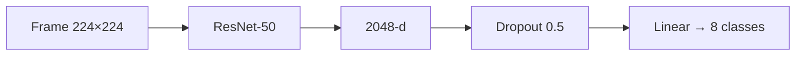
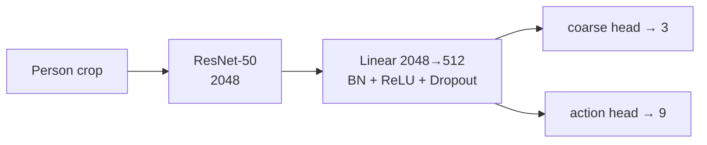
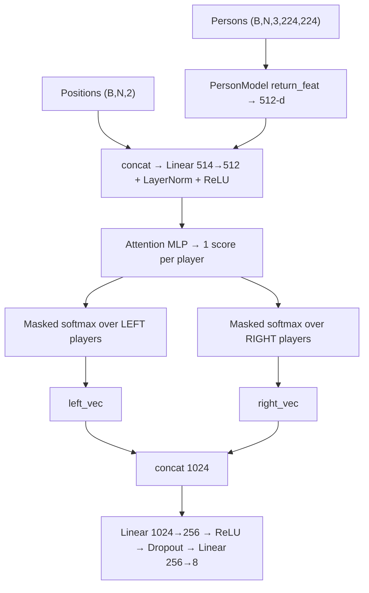
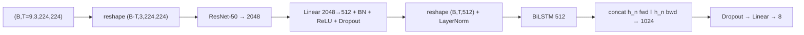
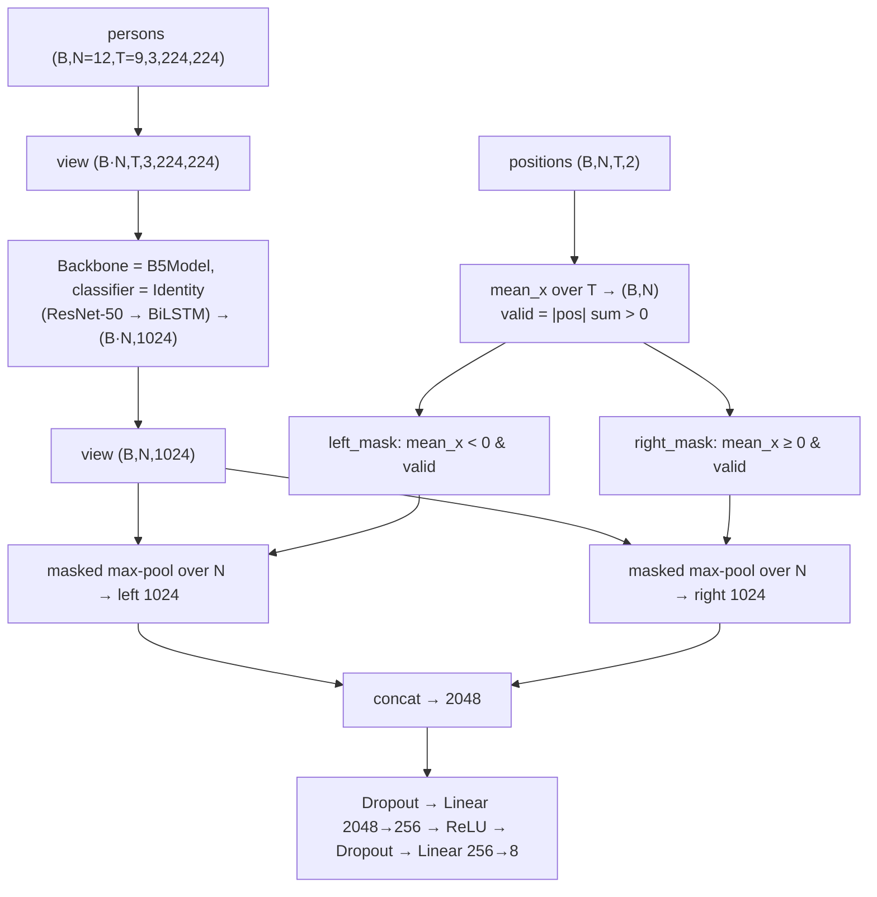

# 🏐 Hierarchical Deep Temporal Model for Group Activity Recognition

> An end-to-end PyTorch reimplementation and modern extension of
> **CVPR 2016 — *A Hierarchical Deep Temporal Model for Group Activity Recognition***
> (Ibrahim, Muralidharan, Deng, Vahdat, Mori).

Recognizing **group activity** in volleyball requires modeling two things at once: what each
individual player is doing over time, and how those individual behaviors combine into a
team-level event.

This repository builds that up **one idea at a time**, as a progressive benchmark, so the
contribution of each idea can be measured independently.

| Step | New idea added | Question it answers |
| :--- | :--- | :--- |
| **B1** | Whole-scene CNN | How far can a single frame go? |
| **B3** | Person model + spatial attention pooling | Does looking at individual players help? |
| **B4** | BiLSTM over the whole frame | Does time help when we still see only the scene? |
| **B5** | Player **tracklets** + court-side pooling | Does combining *person* + *time* + *court side* help? |

---

## 📊 Results

| Baseline | Pipeline | Paper (acc.) | This repo |
| :--- | :--- | ---: | ---: |
| **B1** | ResNet-50 on the middle frame | 66.7 % | **70.0 %** accuracy |
| **B3** | Multi-task person model → left/right attention pooling | 68.1 % | **83.0 %** macro F1 |
| **B4** | 9-frame clip → ResNet-50 → BiLSTM | 63.1 % | **82.2 %** macro F1 |
| **B5** | Tracklet BiLSTM → 2-court max-pool → group classifier | 67.6 % | **87.0 %** macro F1 |
| **B6** | Frame-wise person pooling → sequence LSTM | 74.7 % | *in progress* |
| **B7** | Player LSTMs → global pool → group LSTM | 80.2 % | *in progress* |
| **B8** | Player LSTMs → 2-team spatial pool → group LSTM | 81.9 % | *in progress* |

> ⚠️ **Metric caveat.** The paper reports **accuracy**; B3/B4/B5 here are **macro F1**, which
> is much stricter on minority classes (the dataset is heavily imbalanced). The two numbers are
> **not directly comparable**. All trainers select their best checkpoint on **validation macro F1**.

---

## 🚀 Quick start

```bash
# 1. Environment
conda create -n vision_env python=3.10 -y
conda activate vision_env
pip install torch torchvision --index-url https://download.pytorch.org/whl/cu118
pip install pillow numpy pyyaml scikit-learn pynvml kaggle

# 2. Dataset  (Kaggle: sherif31/group-activity-recognition-volleyball)
kaggle datasets download -d sherif31/group-activity-recognition-volleyball --unzip

# 3. Train something
python runs/baseline1/Run_Baseline1.py
```

Full instructions, dataset layout, and Slurm usage: **[§9 — Getting Started](#9-getting-started)**.

---

## 📖 Contents

1. [Approach](#1-approach)
2. [Dataset](#2-dataset)
3. [Results at a Glance](#3-results-at-a-glance)
4. [Repository Layout](#4-repository-layout)
5. [Data Pipeline](#5-data-pipeline-layer-by-layer)
6. [Baselines in Detail](#6-baselines-in-detail)
7. [Training Framework](#7-training-framework)
8. [Design Patterns](#8-design-patterns-used)
9. [Getting Started](#9-getting-started)
10. [Performance Optimizations](#10-performance--engineering-optimizations)
11. [HPC / Slurm](#11-hpc--slurm-infrastructure)
12. [Limitations & Edge Cases](#12-limitations--known-issues)
13. [Adding a New Baseline](#13-adding-a-new-baseline)
14. [Roadmap](#14-roadmap)
15. [Citations](#15-citations)

---

## 1. Approach

### 1.1 Two levels of dynamics

<p align="center">
  
  <br>
  <em>Figure 2 — Decoupled modeling of atomic person actions and high-level team activity.</em>
</p>

- **Person level** — a temporal representation of what each individual player is doing.
- **Group level** — aggregation of many players into a collective activity such as
  *Right Set*, *Left Spike*, or *Right Winpoint*.

### 1.2 End-to-end hierarchical pipeline

<p align="center">
  
  <br>
  <em>Figure 3 — Tracklet features → person LSTM (LSTM 1) → participant pooling → group LSTM (LSTM 2) → activity class.</em>
</p>

```text
Player Tracklets
      ↓
CNN Feature Extraction (ResNet-50)
      ↓
Person-Level LSTM  (LSTM 1)
      ↓
Spatial / Participant Pooling
      ↓
Group-Level LSTM  (LSTM 2)
      ↓
Group Activity Classification
```

<p align="center">
  
  <br>
  <em>Figure 1 — High-level hierarchical architecture: individual dynamics tracked temporally, then aggregated into a scene network.</em>
</p>

### 1.3 Spatial court-aware pooling

<p align="center">
  
  <br>
  <em>Figure 4 — Splitting players by court side preserves formation geometry before temporal aggregation.</em>
</p>

Players are **not** treated as an unordered set. Each player's normalized `x` coordinate splits
them into left / right, preserving team formation — which matters because **every** group class
is side-specific (`l_*` vs `r_*`).

---

## 2. Dataset

Source: **Volleyball Dataset** (Kaggle — `sherif31/group-activity-recognition-volleyball`).

### 2.1 Scale & splits

- **55** matches, **4,830** annotated keyframes
- Split at the **video level**, so clips from the same match never leak across splits

| Split | #Videos | Video IDs |
| :--- | ---: | :--- |
| Train | 24 | `1, 3, 6, 7, 10, 13, 15, 16, 18, 22, 23, 31, 32, 36, 38, 39, 40, 41, 42, 48, 50, 52, 53, 54` |
| Validation | 15 | `0, 2, 8, 12, 17, 19, 24, 26, 27, 28, 30, 33, 46, 49, 51` |
| Test | 16 | `4, 5, 9, 11, 14, 20, 21, 25, 29, 34, 35, 37, 43, 44, 45, 47` |

### 2.2 Temporal sampling

Each labeled keyframe has **41 raw frames** centered on it; the sequence models sample **9**:

```text
raw:     t-20 … t-1  [ t ]  t+1 … t+20
model:   t-4  … t-1  [ t ]  t+1 … t+4
```

For **tracking annotations** (B5) each player's tracklet holds **20** frames; the code slices
`[5:14]` → 9 frames centered on the tracklet's middle index.

### 2.3 Resolution

Videos `2, 37, 38, 39, 40, 41, 44, 45` are **1920 × 1080**; all others **1280 × 720**.
Player positions are therefore always **normalized by image size** (see §5.4).

### 2.4 Classes

**8 group activities**

| Group activity | Count | | Atomic action | Count |
| :--- | ---: | :--- | :--- | ---: |
| Right set | 644 | | Waiting | 3,601 |
| Right spike | 623 | | Setting | 1,332 |
| Right pass | 801 | | Digging | 2,333 |
| Right winpoint | 295 | | Falling | 1,241 |
| Left winpoint | 367 | | Spiking | 1,216 |
| Left pass | 826 | | Blocking | 2,458 |
| Left spike | 642 | | Jumping | 341 |
| Left set | 633 | | Moving | 5,121 |
| | | | Standing | 38,696 |

> ⚠️ **Severe imbalance:** `Standing` is **> 55 %** of all person boxes, while `Jumping` is only
> ~0.6 %. Handled by `person_collate` (§5.5) and by Focal / multitask loss (§10.1).

### 2.5 Annotation formats

**`videos/<vid>/annotations.txt`** — one line per keyframe:

```text
<frame>.jpg  <group_label>  x y w h <action>  x y w h <action>  ...
```

Each player is 5 tokens (`x y w h action`). Dash labels (`r-set`) are normalized to
underscore (`r_set`) by `LABEL_FIX`.

**`volleyball_tracking_annotation/<vid>/<clip>/<clip>.txt`** — one line per (player, frame):

```text
track_id xmin ymin xmax ymax frame_id flag1 flag2 flag3 action
```

---

## 3. Results at a Glance

### 3.1 Capability matrix

| | B1 | B3 | B4 | B5 |
| :--- | :---: | :---: | :---: | :---: |
| Individual players | ✗ | ✔ | ✗ | ✔ |
| Uses time | ✗ | ✗ | ✔ | ✔ |
| Uses player positions | ✗ | ✔ | ✗ | ✔ |
| Court-side split | ✗ | ✔ *(attention)* | ✗ | ✔ *(max-pool)* |
| Training stages | 1 | 2 | 1 | 2 |
| Input per sample | 1 frame | 1 frame, ≤N crops | 9 full frames | N tracklets × 9 frames |
| Group feature dim | 2048 | 1024 | 1024 | 2048 |
| Multi-GPU (DDP) | – | – | – | ✔ |

### 3.2 Progression

```text
Whole Scene (B1)
    ↓
Individual Players (B3)
    ↓
Temporal Dynamics (B4)
    ↓
Player Tracklets + Court-Side Pooling (B5)
    ↓
Group Temporal Dynamics (B6–B8, in progress)
    ↓
Group Activity Recognition
```

---

## 4. Repository Layout

```text
volleyball_project/
│
├── configs/                             # YAML hyperparameter & runtime configs
│   ├── base.yaml  base_ddp.yaml
│   ├── baseline1.yaml
│   ├── baseline3_person.yaml  baseline3_group.yaml
│   ├── baseline4.yaml
│   └── baseline5.yaml  baseline5_ddp.yaml  baseline5_stage2_ddp.yaml
│
├── dataset/                             # ── DATA PIPELINE ──
│   ├── raw_dataset.py                   # VolleyballRawDataset  — frame annotations
│   ├── tracking_raw_dataset.py          # TrackingRawDataset     — single-player tracklet
│   ├── TrackingGroupRawDataset.py       # TrackingRawDataset     — clip, all players
│   ├── adapters/
│   │   ├── base_adapter.py              # BaseAdapter  (template method + uint8 cache)
│   │   ├── frame_adapter.py             # whole frame              → B1
│   │   ├── group_adapter.py             # all person crops of a frame → B3 stage 2
│   │   ├── person_adapter.py            # one person crop          → B3 stage 1
│   │   ├── Clip_Adapter.py              # 9-frame whole-scene clip → B4
│   │   ├── tracking_adapter.py          # one player tracklet      → B5 stage 1
│   │   └── TrackingGroupAdapter.py      # all tracklets of a clip  → B5 stage 2
│   ├── collect.py                       # person_collate / group_collate
│   ├── transforms.py                    # BaseTransform / BaseTransformV2 families
│   └── data_loader.py                   # build_dataloader() factory
│
├── models/
│   ├── backbones/resnet50.py            # shared feature extractor (2048-d)
│   ├── baseline_model1/baseline1.py     # whole-scene classifier
│   ├── baseline_model3/baseline3.py     # PersonModel + attention GroupModel
│   ├── baseline_model4/baseline4.py     # frame-sequence BiLSTM
│   └── baseline_model5/
│       ├── baseline5.py                 # B5Model — person tracklet BiLSTM
│       └── GroupBaselineModel.py        # court-side pooling group model
│
├── losses/
│   ├── focal_loss.py                    # class-imbalance loss
│   └── multitask_loss.py                # action + coarse-motion multitask loss
│
├── trainers/
│   ├── base_trainer.py                  # single GPU (AMP, hooks, checkpointing)
│   ├── DDP_base_trainer.py              # multi-GPU  (all-reduce / all-gather)
│   ├── person_trainer.py                # multi-task trainer
│   └── group_trainer.py                 # dict-input trainers (single GPU & DDP)
│
├── utils/
│   ├── label_maps.py                    # PERSON_ACTION_TO_IDX, GROUP_ACTION_TO_IDX
│   ├── metrics.py                       # accuracy / macro F1 / per-class table
│   ├── checkpoint.py                    # save + load helpers
│   ├── seed.py                          # deterministic seeding
│   └── visualization.py                 # qualitative render helpers
│
├── runs/                                # training entry points
│   ├── baseline1/Run_Baseline1.py
│   ├── baseline3/Run_Baseline3_person_model.py
│   ├── baseline3/Run_Baseline3_group_model.py
│   ├── baseline4/Run_Baseline4.py
│   ├── baseline5/Run_Baseline5_seq.py
│   ├── baseline5/Run_Baseline5_ddp.py
│   └── baseline5/Run_GroupBaseline5_ddp.py
│
├── images/                              # figures used in this README
├── outputs/  logs/  runs-checkpoints/   # generated artifacts
│
├── run_volleyball.sh                    # Slurm — single GPU
├── run_volleyball_ddp.sh                # Slurm — multi GPU (torchrun)
├── hpc_command                          # HPC notes & commands
├── CommandLine.txt                      # CLI reference
└── README.md
```

---

## 5. Data Pipeline (Layer by Layer)

The data side is split into **four independent layers**. Each has exactly one job, so changing
one — for example adding a new augmentation — never forces changes in the others.


### 5.1 Raw datasets — *"what is in the files?"*

Raw datasets **only parse text and build file paths**. They never open images, never produce
tensors.

| Class (file) | One sample is… | Used by |
| :--- | :--- | :--- |
| `VolleyballRawDataset`<br/>`raw_dataset.py` | `{"img": path, "label": group_label, "ann": [tokens…]}` — one keyframe with all player boxes | B1, B3, B4 |
| `TrackingRawDataset`<br/>`tracking_raw_dataset.py` | `{video_id, clip_id, track_id, frames[20], boxes[20], label}` — **one player tracklet**; label = action at the **middle** frame (`len//2`) | B5 stage 1 |
| `TrackingRawDataset`<br/>`TrackingGroupRawDataset.py` | `{video_id, clip_id, group_label, players:[{track_id, frames, boxes}, …]}` — **one clip with all its players** | B5 stage 2 |

Notes:

- `LABEL_FIX` maps dash labels (`r-pass`) → underscore (`r_pass`).
- Clips with no matching folder on disk are **skipped silently**.
- In the group version, group labels are joined from `annotations.txt` under key
  `"{video_id}_{clip_id}"`; a clip without a label gets `"unknown"`.

> ⚠️ **Naming collision (intentional, current state):** two *different* classes are both called
> `TrackingRawDataset`, and two adapters are both called `TrackingAdapter`. Always import them
> from their module path, never by bare name:
> ```python
> from dataset.tracking_raw_dataset import TrackingRawDataset          # stage 1
> from dataset.TrackingGroupRawDataset import TrackingRawDataset       # stage 2
> from dataset.adapters.tracking_adapter import TrackingAdapter         # stage 1
> from dataset.adapters.TrackingGroupAdapter import TrackingAdapter     # stage 2
> ```

### 5.2 Adapters — *"how do I turn a raw sample into a tensor?"*

All adapters inherit `BaseAdapter` (Template Method, §8.1) and share one skeleton:

```text
__init__   → build_index()      # hook 1 — what is one sample?
__getitem__ → load_sample(idx)  # hook 2 — how do I load it?
            → transform(crop)
            → (crop, label)
```

| Adapter | `__getitem__` output | Index unit | Notes |
| :--- | :--- | :--- | :--- |
| `FrameAdapter` | `(img[3,224,224], group_label)` | 1 per keyframe | Resized to 256×256 and cached as `uint8`; transform random-crops to 224 |
| `PersonAdapter` | `(crop[3,224,224], action_label)` | 1 per **person box** `(img_id, token_offset)` | 15 % padding; only boxes whose action is in `label_map` |
| `GroupAdapter` | `(crops[N,3,224,224], positions[N,2], group_label)` | 1 per keyframe | Overrides `__getitem__` (3 values); `N` varies per frame |
| `ClipAdapter` | `(clip[T,3,224,224], group_label)`, `T = 2·n_frames+1 = 9` | 1 per keyframe | Uses a **directory-listing cache** |
| `TrackingAdapter` | `(Video[9,3,224,224], action_label)` | 1 per tracklet | Frames `[5:14]`; LRU cache of `uint8` (default 1500) |
| `TrackingGroupAdapter` | `({"persons": Video[12,9,3,224,224], "positions": [12,9,2]}, group_label)` | 1 per clip | Fixed 12-player tensor, zero-padded; LRU cache (default 1100 clips) |

### 5.3 Image caching strategy

JPEG decoding is the main bottleneck, so adapters cache **already-resized `uint8` arrays**
(not float tensors):

- **Frame / Person / Group adapters** — `self._cache` (plain `dict`) holds `np.uint8` 256×256
  arrays. Random crop and augmentation still run on every access, so **randomness is preserved**.
- **Tracking adapters** — `OrderedDict` used as a **LRU cache** (`pop` + re-insert on hit,
  `popitem(last=False)` on overflow). Every hit returns a `.clone()` so in-place transforms
  cannot corrupt the cache.
- **`ClipAdapter`** — `_dir_cache` stores the sorted `.jpg` list per clip directory, removing
  repeated `os.listdir` calls.

> ⚠️ Each DataLoader worker owns its **own copy** of the cache (see §12.1).

### 5.4 Position encoding

Every player gets a normalized, zero-centered position:

```text
center_x = ((x1 + x2) / 2) / image_width  − 0.5     ∈ [−0.5, +0.5]
center_y = ((y1 + y2) / 2) / image_height − 0.5
```

- `x < 0` → left half of the image / court
- `x ≥ 0` → right half
- Normalizing makes 1080p and 720p videos directly comparable

### 5.5 Collate functions (`collect.py`)

| Function | Used by | Behavior |
| :--- | :--- | :--- |
| `person_collate` | B3 person model | Stacks person crops but **caps `standing` samples at 4 per batch** — a cheap fix for the 55 %+ imbalance. Effective batch size is therefore **variable** (≤ requested). |
| `group_collate` | B3 group model | Frames have different player counts. Finds `max_n` in the batch, allocates zero tensors `persons[B,max_n,3,224,224]` and `positions[B,max_n,2]`, copies samples into the front. Returns `({"persons","positions"}, labels)`. All-zero padded slots later act as *invalid players*. |

B5 needs **no custom collate** — `TrackingGroupAdapter` already pads to a fixed 12 players, so
PyTorch's default collate suffices.

### 5.6 Transforms (`transforms.py`)

Fixed pipeline order for every transform:

```text
Resize → Crop → [Augmentations] → ToTensor → Normalize   (ImageNet mean/std)
```

| Class | For | Augmentations |
| :--- | :--- | :--- |
| `Baseline1Transform` | B1 | Rotation(3°), ColorJitter(0.3, 0.3, 0.3, 0.1) |
| `B3FrameTransform` | B3 frame-level | Rotation(3°), ColorJitter(0.2, 0.2, 0.2, 0.05) |
| `PersonTransform` | B3 person crops | HFlip(0.5), Rotation(5°, p=0.7), ColorJitter, Grayscale(0.05), Sharpness(0.1); resizes straight to 224, **no center crop** at val |
| `B4LSTMTransform` | B4 | Rotation(3°, p=0.7), ColorJitter(0.2, 0.2, 0.2, 0.05) |
| `B5PersonTransform` (v2) | B5 stage 1 | HFlip, Rotation(5°, p=0.7), ColorJitter, Grayscale, Sharpness |
| `B5GroupTransform` (v2) | B5 stage 2 | Rotation(3°), ColorJitter(0.2, 0.2, 0.2, 0.05) |

Two families:

- **`BaseTransform`** — classic `torchvision.transforms`, PIL input. Supports `use_cache=True`
  to skip Resize when the cache already resized to 256.
- **`BaseTransformV2`** — `torchvision.transforms.v2`, tensor input. Adds
  `ToDtype(float32, scale=True)` + `Normalize`. Used by the tracking adapters.

> 🎯 **Temporal consistency.** The tracking adapters flatten `(N, T, C, H, W)` → `(N·T, C, H, W)`
> and call the v2 transform **once**. v2 samples its random parameters once per call, so the
> **same** flip / rotation / jitter applies to every frame and every player of a clip — a
> tracklet must not flicker between frames.

### 5.7 DataLoader (`data_loader.py`)

`build_dataloader()` is a thin factory that fixes performance defaults: `pin_memory=True`,
`persistent_workers=True` (keeps workers — and therefore their caches — alive between epochs),
and a small `prefetch_factor`. It accepts a custom `collate_fn` and a `sampler`
(`DistributedSampler` for DDP).

---

## 6. Baselines in Detail

All models share the same backbone:

```python
ResNet50(pretrained=True)   # ImageNet weights, final FC removed
# input (B, 3, 224, 224) → output (B, 2048)     out_dim = 2048
```

### 6.1 B1 — Whole-scene image classifier

**Idea.** Ignore players completely; classify from the middle frame only. The weakest
reasonable model — it defines the lower bound.



| Item | Value |
| :--- | :--- |
| Model | `Baseline1(backbone, num_classes, drop_p=0.5)` |
| Adapter | `FrameAdapter` |
| Transform | `Baseline1Transform` |
| Loss / metric | Cross-entropy; accuracy + macro F1 |
| Trainer | `BaseTrainer` |
| **Result** | **70.0 %** accuracy (paper: 66.7 %) |

**Why it works:** the camera is fixed and court layout is highly informative — ball height, the
jumping player, and the side of the court already reveal a lot.

**Limits:** no notion of *who* does *what*, and no time.

---

### 6.2 B3 — Person model + attention group model (two stages)

**Idea.** First learn what a single person is doing, then reuse that knowledge for the scene.

#### Stage 1 — `PersonModel` (multi-task)



- **Two heads on one shared 512-d feature:**
  - `action_head` — 9 atomic actions (the main target)
  - `coarse_head` — 3 coarse motion groups (auxiliary task that regularizes the shared space)
- `forward(x)` → `(coarse_logits, action_logits)`; `forward(x, return_feat=True)` → the
  **512-d shared feature** reused by stage 2.
- Adapter `PersonAdapter` (15 % padded crops), collate `person_collate`, transform
  `PersonTransform`.
- Trainer `PersonTrainer` overrides `compute_loss` to unpack `(total, action_loss, motion_loss,
  action_targets)` and log both parts via the `extras` dict.

#### Stage 2 — `GroupModel` (attention pooling)



1. Fold `(B, N)` into one big batch → extract **512-d person features** with the pre-trained
   `PersonModel` → unfold again.
2. **Concatenate the 2-d position** to each feature and project back to 512-d (`projection`).
3. A small MLP (`Linear → Tanh → Linear(1)`) produces one **attention logit** per player.
4. `valid_mask` marks real players (padded slots are all-zero crops).
5. Players split by `x < 0` (left) vs `x ≥ 0` (right). Padded and other-side players get `-inf`
   logits, so the **per-side softmax** distributes weight only among real players on that side.
   A temperature of `0.8` softens the logits.
6. Weighted sums → `left_vec`, `right_vec` → concat 1024-d → MLP classifier → 8 classes.

| Item | Value |
| :--- | :--- |
| Models | `PersonModel`, `GroupModel(person_model, feat_dim=512, num_classes=8)` |
| Adapters | `PersonAdapter`, `GroupAdapter` |
| Collate | `person_collate`, `group_collate` |
| Trainers | `PersonTrainer`, `GroupTrainer` |
| **Result** | **83.0 %** macro F1 (paper: 68.1 % acc.) |

**Why it works:** the person model provides a strong action-aware feature; attention lets the
group model focus on the *key actor* (e.g. the spiker); the left/right split encodes side.

**Limits:** still a **single frame** — no motion.

---

### 6.3 B4 — Scene-level frame sequence with BiLSTM

**Idea.** Keep B1's whole-scene view but add **time**: 9 consecutive frames through an LSTM.



**Shape flow**

| Step | Shape |
| :--- | :--- |
| Input clip | `(B, 9, 3, 224, 224)` |
| Fold time into batch | `(B·9, 3, 224, 224)` |
| Backbone | `(B·9, 2048)` |
| Projection | `(B·9, 512)` |
| Unfold + LayerNorm | `(B, 9, 512)` |
| BiLSTM last hidden (fwd + bwd) | `(B, 1024)` |
| Classifier | `(B, 8)` |

| Item | Value |
| :--- | :--- |
| Model | `B4ClipModel(backbone, hidden_dim=512, num_classes=8, bidirectional=True)` |
| Adapter | `ClipAdapter(n_frames=4)` → 4 + keyframe + 4 = 9 frames |
| Transform | `B4LSTMTransform` |
| **Result** | **82.2 %** macro F1 (paper: 63.1 % acc.) |

**Design notes**

- `BatchNorm1d` runs on the **folded** `(B·T, 512)` tensor; `LayerNorm` after unfolding
  stabilizes the LSTM input.
- The LSTM is **bidirectional**; final forward and backward hidden states are concatenated.
- Each frame gets an **independent** random crop / augmentation — a mild regularizer.

**Limits:** one global feature per frame — still no per-player reasoning.

---

### 6.4 B5 — Player tracklet BiLSTM + court-side pooling (two stages)

**Idea.** Follow each **player over time**, describe each with CNN + BiLSTM, pool players **per
court side**, classify the group activity. The closest baseline to the paper's full model.

#### Stage 1 — `B5Model` (person tracklet)

Identical to `B4ClipModel` except:

- input is a **player crop sequence** `(B, 9, 3, 224, 224)` instead of a whole frame
- the projection has **no BatchNorm** (`Linear → ReLU → Dropout`)
- the classifier predicts the **9 atomic actions**

Trained with `TrackingAdapter` (label = action at middle frame) and `B5PersonTransform`.

#### Stage 2 — `GroupBaselineModel`



1. **Transfer** — the stage-1 `B5Model` becomes the backbone; its `classifier` is replaced by
   `nn.Identity()` so it returns the raw **1024-d BiLSTM feature** (`512 × 2`).
2. **Parallel processing** — `(B, N, T, C, H, W)` folds into `(B·N, T, C, H, W)`, so all
   players of all clips pass through CNN-LSTM in one vectorized call.
3. **Masks** — a player is *valid* if its position tensor is not all-zero. Mean `x` over the 9
   frames decides left (`< 0`) vs right (`≥ 0`).
4. **Court-side max pooling** — other-side and padded features are `masked_fill`ed with
   `torch.finfo(...).min` so they can never win the `max`. One max-pool per side.
5. The two 1024-d vectors concatenate (2048-d) → 8 classes.

| Item | Value |
| :--- | :--- |
| Models | `B5Model` (stage 1), `GroupBaselineModel` (stage 2) |
| Raw datasets | `tracking_raw_dataset.py` (stage 1), `TrackingGroupRawDataset.py` (stage 2) |
| Adapters | `TrackingAdapter`, `TrackingGroupAdapter` |
| Transforms | `B5PersonTransform`, `B5GroupTransform` (v2) |
| Trainers | `BaseTrainer`, `GroupTrainer_ddp` (multi-GPU) |
| **Result** | **87.0 %** macro F1 (paper: 67.6 % acc.) |

**Why it beats B3/B4:** tracklets use *person-specific* motion — not only appearance (B3) and
not only global scene motion (B4) — and court-side pooling gives a side-aware summary of each
team.

---

## 7. Training Framework

### 7.1 `BaseTrainer` (`trainers/base_trainer.py`)

Owns the whole training lifecycle and **never needs to be copied** for a new baseline.

```text
for epoch:
    train_result = _run_epoch(train_loader, training=True)
    val_result   = _run_epoch(val_loader,   training=False)
    scheduler.step()
    print_epoch(...)
    if val F1 ≥ best: save_checkpoint(...)
```

Inside `_run_epoch`:

- `torch.enable_grad()` vs `torch.no_grad()` depending on phase
- **Mixed precision** (`torch.amp.autocast` + `GradScaler`) on CUDA
- skips degenerate batches (`y is None` or batch size ≤ 1) — important because `BatchNorm1d`
  cannot train on one sample and `person_collate` can shrink a batch
- collects all predictions/targets and computes **accuracy** and **macro F1** at the **epoch**
  level (not averaged per batch)
- optional **per-class accuracy table** (`print_perclass=True`)
- accumulates extra loss terms returned by the hook (used by the multi-task trainer)
- **checkpoint criterion: validation macro F1**

Everything that varies is injected through the constructor (`loss_fn`, `accuracy`, `f1_score`,
`save_checkpoint`, `scheduler`, …) — see Strategy / DI in §8.4.

### 7.2 Hooks (Template Method)

| Hook | Default behavior | Overridden in |
| :--- | :--- | :--- |
| `move_input(x)` | `x.to(device)` | `GroupTrainer`, `GroupTrainer_ddp` → moves every tensor of the dict |
| `compute_loss(outputs, y)` | `(loss_fn(outputs, y), argmax, y, {})` | `PersonTrainer` → unpacks `(coarse, action)` logits, returns action predictions and `extras={"action", "motion"}` |
| `compute_Accuracys` / `compute_f1` | call the injected metric functions | – |
| `print_epoch(...)` | prints loss / acc / F1 | `PersonTrainer` (adds action and motion loss) |

### 7.3 `DDP_base_trainer.py` — multi-GPU

Same lifecycle plus everything `torchrun` needs:

| Concern | Solution |
| :--- | :--- |
| Who prints and saves? | `is_master = int(os.environ["RANK"]) == 0` (global rank — safe for multi-node) |
| Different shuffle every epoch | `sampler.set_epoch(epoch)` when supported |
| Metrics over the **whole** val set | `_gather_all` → `dist.all_gather_object`, concatenates all ranks' predictions before computing F1 |
| Per-class counters | `_sum_over_gpus` → `dist.all_reduce(SUM)` on CPU (what `gloo` handles best) |
| Mean loss | `all_reduce` of `[total_loss, batch_count]` |
| Loading checkpoints in single-GPU code | saves `model.module` when wrapped, so the file loads in a normal environment |

### 7.4 Specialized trainers

- **`PersonTrainer`** — multi-task bookkeeping (action + motion losses logged separately)
- **`GroupTrainer` / `GroupTrainer_ddp`** — override only `move_input`, because the model input
  is a dict `{"persons", "positions"}`

---

## 8. Design Patterns

The repository is deliberately **small-class and pattern-driven**. Every pattern below solves a
concrete duplication or coupling problem that appeared while building the baselines.

### 8.1 Template Method — dataset adapters

**Problem.** `FrameAdapter`, `PersonAdapter` and `GroupAdapter` each copied the same `__init__`,
`__len__`, and `Image.open().convert("RGB")`.

**Solution.** `BaseAdapter` owns the fixed skeleton; subclasses fill the hooks.

```python
class BaseAdapter(Dataset):
    def __init__(self, raw_dataset, transform, label_map):
        ...
        self._index = self.build_index()      # HOOK 1
        self._cache = {}                      # shared by all subclasses

    def build_index(self): return list(range(len(self.raw)))   # default
    def load_sample(self, idx): raise NotImplementedError      # HOOK 2

    def __getitem__(self, idx):               # TEMPLATE
        crop, label = self.load_sample(idx)
        if self.transform: crop = self.transform(crop)
        return crop, label
```

| Subclass | `build_index` | `load_sample` / `__getitem__` |
| :--- | :--- | :--- |
| `FrameAdapter` | inherited | overrides `load_sample` |
| `PersonAdapter` | **overrides** → `(img_id, token_offset)` per person | overrides `load_sample` |
| `GroupAdapter`, `ClipAdapter` | returns `[]` | **overrides `__getitem__`** (different return signature / multiple frames) |
| `TrackingAdapter`, `TrackingGroupAdapter` | inherited | overrides `load_sample` (+ `__getitem__` for the group version, to flatten `N×T` before the transform) |

> **Rule.** Overriding `__getitem__` is acceptable **only** when the return signature differs
> from `(sample, label)`.

### 8.2 Template Method — transforms

**Problem.** The `Normalize(mean, std)` line was copy-pasted six times; every new baseline meant
two more copies.

**Solution.** `BaseTransform.train()` / `.val()` fix the pipeline order; only
`get_train_augmentations()` is overridden.

```text
Resize → [RandomCrop | CenterCrop] → (augmentations hook) → ToTensor → Normalize
```

A **class, not a factory function**, is used because transforms always come as a **train/val
pair** — one object keeps both consistent. `PersonTransform` overrides `val()` because tight
person crops must not be center-cropped.

### 8.3 Template Method / Hook — trainers

`BaseTrainer` is the template (`train` → `_run_epoch`); `move_input`, `compute_loss` and
`print_epoch` are hooks. This lets a multi-task person trainer and a dict-input group trainer
exist without duplicating AMP, scaling, checkpointing, or metric code.

### 8.4 Strategy & Dependency Injection

Behavior that changes between experiments is **passed in, never hard-coded**:

- `loss_fn` (CrossEntropy / Focal / MultiTask), `scheduler`, `optimizer`
- `accuracy`, `f1_score`, `save_checkpoint` functions
- `transform` objects and `label_map` dicts for adapters
- `collate_fn` and `sampler` for the DataLoader
- the **`backbone`** for every model (`Baseline1(backbone, …)`, `B4ClipModel(backbone, …)`), so
  ResNet-50 can be swapped without touching any head

### 8.5 Composition / decorator-style model wrapping

Higher-level models **wrap** lower-level ones instead of inheriting:

- `GroupModel` holds a `PersonModel` and calls it with `return_feat=True`
- `GroupBaselineModel` holds a `B5Model` and replaces its `classifier` with `nn.Identity()`

Clean transfer learning (pre-train stage 1, plug into stage 2) and trivial freeze / fine-tune.

### 8.6 Adapter pattern (structural)

`dataset/adapters/` literally **adapts** one interface to another: raw datasets speak in *paths
and strings* (`{"img": path, "ann": [...]}`); models speak in *tensors and integer labels*.
Raw datasets know the file format, adapters know the model's needs — neither knows the other.

### 8.7 Separation of Concerns (layered pipeline)

```text
Raw Dataset  →  Adapter  →  Transform  →  DataLoader/collate  →  Model  →  Trainer
  (files)       (tensors)    (augment)      (batching)           (math)    (loop)
```

Each arrow is a clean interface: changing the augmentation never touches the parser, and vice
versa.

### 8.8 Caching patterns

- **Memoization** — `_cache` (decoded + resized `uint8` crops), `_dir_cache` (directory listings)
- **LRU cache** — `OrderedDict` with pop/re-insert on hit, `popitem(last=False)` on overflow
- **Defensive copy** — `.clone()` before returning cached tensors so in-place transforms cannot
  corrupt the cache

### 8.9 Pattern → file map

| Pattern | Where |
| :--- | :--- |
| Template Method (data) | `base_adapter.py` + all adapters |
| Template Method (transforms) | `transforms.py` (`BaseTransform`, `BaseTransformV2`) |
| Template Method / Hooks (training) | `base_trainer.py`, `DDP_base_trainer.py`, `person_trainer.py`, `group_trainer.py` |
| Strategy / DI | trainer constructors, model constructors, `build_dataloader` |
| Composition | `GroupModel`, `GroupBaselineModel` |
| Adapter | `dataset/adapters/*` |
| Caching (memo / LRU) | `base_adapter.py`, `Clip_Adapter.py`, `tracking_adapter.py`, `TrackingGroupAdapter.py` |

---

## 9. Getting Started

### 9.1 Environment

```bash
conda create -n vision_env python=3.10 -y
conda activate vision_env
pip install torch torchvision --index-url https://download.pytorch.org/whl/cu118
pip install pillow numpy pyyaml scikit-learn pynvml kaggle
```

> `tv_tensors` and `torchvision.transforms.v2` (used by B5) need a recent `torchvision` (≥ 0.16).

### 9.2 Dataset layout

```text
volleyball_data/
├── videos/
│   ├── 0/
│   │   ├── annotations.txt
│   │   ├── 13286/
│   │   │   ├── 13276.jpg
│   │   │   └── ...
│   └── ...
│
└── volleyball_tracking_annotation/
    ├── 0/
    │   └── 13286/
    │       └── 13286.txt
    └── ...
```

Download with the Kaggle CLI:

```bash
kaggle datasets download -d sherif31/group-activity-recognition-volleyball --unzip
```

### 9.3 Configuration

Hyperparameters live in `configs/*.yaml`; every baseline has a matching file, plus shared
`base.yaml` / `base_ddp.yaml` defaults.

| Config | Baseline |
| :--- | :--- |
| `baseline1.yaml` | B1 — whole-scene classifier |
| `baseline3_person.yaml` | B3 stage 1 — multi-task person model |
| `baseline3_group.yaml` | B3 stage 2 — attention group model |
| `baseline4.yaml` | B4 — frame-sequence BiLSTM |
| `baseline5.yaml` | B5 stage 1 — tracklet BiLSTM (sequence) |
| `baseline5_ddp.yaml` | B5 stage 1 — tracklet BiLSTM (multi-GPU) |
| `baseline5_stage2_ddp.yaml` | B5 stage 2 — court-side group pooling (multi-GPU) |

### 9.4 Running experiments

```bash
# B1 — whole-image ResNet-50
python runs/baseline1/Run_Baseline1.py

# B3 — person multi-task, then attention group model
python runs/baseline3/Run_Baseline3_person_model.py
python runs/baseline3/Run_Baseline3_group_model.py

# B4 — frame-level BiLSTM
python runs/baseline4/Run_Baseline4.py

# B5 — tracklet BiLSTM (stage 1), single GPU / multi GPU
python runs/baseline5/Run_Baseline5_seq.py
torchrun --standalone --nproc_per_node=2 runs/baseline5/Run_Baseline5_ddp.py

# B5 — court-side group pooling (stage 2), multi GPU
torchrun --standalone --nproc_per_node=2 runs/baseline5/Run_GroupBaseline5_ddp.py
```

### 9.5 Slurm

```bash
sbatch run_volleyball.sh        # single GPU
sbatch run_volleyball_ddp.sh    # multi GPU via torchrun
```

### 9.6 Environment variables

| Variable | Purpose |
| :--- | :--- |
| `TORCH_HOME` | Move pretrained-weight cache to local disk (NFS quota) |
| `KAGGLE_CACHE_DIR` | Redirect the Kaggle download cache off NFS |
| `WORLD_SIZE`, `RANK`, `LOCAL_RANK` | Set automatically by `torchrun` |

---

## 10. Performance & Engineering Optimizations

### 10.1 Class balancing

`person_collate` caps `standing` samples at 4 per batch. Loss-level balancing — **Focal loss**
and the **multitask loss** — lives in `losses/` and is configured in the run scripts.

### 10.2 Directory-listing cache

`ClipAdapter._dir_cache[clip_dir]` stores the sorted `.jpg` list once; later accesses cost zero
disk I/O.

### 10.3 RAM-efficient `uint8` caching

Crops are stored as `np.uint8` at 256×256 (`torch.uint8` tensors for tracklets) — **4× smaller**
than `float32`. Normalization is deliberately delayed until after the cache, inside the
transform.

### 10.4 Dimension folding for GPU parallelism

`(B, N, T, C, H, W) → (B·N, T, C, H, W)` (and `(B, T, …) → (B·T, …)` in B4) lets the CNN and
LSTM process every player / frame in **one vectorized call**; `view` restores the structure.

### 10.5 Mixed precision

`torch.amp.autocast` + `GradScaler` are enabled automatically on CUDA, with
`cudnn.benchmark = True` for fixed-size inputs.

### 10.6 DataLoader tuning

`pin_memory`, `persistent_workers`, `prefetch_factor` and `non_blocking=True` transfers minimize
GPU idle time.

### 10.7 Zero-redundancy multi-GPU synchronization

Metrics are computed **once** on the fully gathered prediction set, only rank 0 logs and saves,
and checkpoints are saved without the DDP wrapper.

---

## 11. HPC / Slurm Infrastructure

Both scripts target a cluster with **NFS** home directories and **local `/tmp`** disks.

| Concern | Solution in the scripts |
| :--- | :--- |
| NFS quota (30 GB) | Dataset is downloaded to `/tmp/$USER/volleyball_data`; `KAGGLE_CACHE_DIR` redirected |
| Re-downloading every job | "Smart download" — skipped if `videos/` already exists on that node |
| Dataset lives on one node | `--nodelist=gpu1` pins the job to the node holding the data |
| Pretrained-weights quota error | `TORCH_HOME=/tmp/$USER/torch_cache` |
| 4 processes downloading weights at once | Weights are downloaded **once** before `torchrun` starts |
| Multi-GPU launch | `torchrun --standalone --nproc_per_node=N` (single node, no rendezvous config) |
| Backend | `gloo` (no NCCL P2P flag needed) |
| GPU profiling (optional) | Background `pynvml` sampler writes `gpu_profile.csv` every 10 s; a `trap` guarantees cleanup at job end |

---

## 12. Limitations & Known Issues

### 12.1 Resource management & caching

- **Cache memory limits.** A cached group clip is `12 × 9 × 3 × 224 × 224` bytes (**≈ 15.5 MiB**).
  With the default `cache_size=1100` that is **≈ 17 GB per DataLoader worker**. Since each worker
  keeps its own cache, reduce `cache_size` or `num_workers` on smaller nodes.
- **Dynamic batch sizes.** `person_collate` caps `standing` samples, so the effective batch size
  varies globally — and BatchNorm batches can occasionally become small.

### 12.2 Algorithmic edge cases

- **Position masking (B5).** Validity is `abs().sum() > 0` on the `(N, T, 2)` position tensor.
  A player sitting *exactly* at the geometric image center `(0, 0)` for all 9 frames would be
  treated as padding. Practically impossible in sports footage, but it is a real edge case of
  the masking logic.
- **Empty court sides.** If a frame has no valid players on one side, the softmax (B3) or
  max-pool (B5) runs entirely over masked values. B3 degrades gracefully to a uniform average;
  B5 returns the minimum float value.
- **Name collisions.** `TrackingRawDataset` and `TrackingAdapter` each exist twice in different
  modules — import by full module path (§5.1).

### 12.3 Metrics

- Paper numbers are **accuracy**; B3/B4/B5 here are **macro F1**. Do not compare them directly.
- Best-checkpoint selection uses **validation macro F1** in all trainers.

---

## 13. Adding a New Baseline

Checklist:

1. **Raw data** — reuse a raw dataset, or add one that only parses files.
2. **Adapter** — subclass `BaseAdapter`; implement `load_sample` (and `build_index` if one raw
   sample ≠ one training sample). Override `__getitem__` only if the return signature differs.
3. **Transform** — subclass `BaseTransform` (or `BaseTransformV2`); override only
   `get_train_augmentations()`.
4. **Model** — take a `backbone` in the constructor; wrap earlier-stage models by composition.
5. **Trainer** — reuse `BaseTrainer` / DDP `BaseTrainer`; override only the hooks you need
   (`move_input`, `compute_loss`, `print_epoch`).
6. **Config** — add `configs/baselineN.yaml` next to the existing ones.
7. **Run script** — assemble: datasets → adapters → loaders → model → trainer → `trainer.train()`.

---

## 14. Roadmap

- **B6** — frame-by-frame person pooling → sequence LSTM
- **B7** — full two-stage model: player LSTMs → global pooling → group LSTM
- **B8** — full two-stage model with 2-team spatial pooling → group LSTM
- Unit tests for adapters and collate functions
- Config-driven run scripts for all baselines (config files exist; loader wiring in progress)
- Resolve the `TrackingRawDataset` / `TrackingAdapter` duplicate class names

---

## 15. Citations

If you use this implementation or build on the referenced work, please cite the original
publications.

```bibtex
@inproceedings{ibrahim2016hierarchical,
  title={A hierarchical deep temporal model for group activity recognition},
  author={Ibrahim, Mostafa S and Muralidharan, Srikanth and Deng, Zhiwei and Vahdat, Arash and Mori, Greg},
  booktitle={Proceedings of the IEEE Conference on Computer Vision and Pattern Recognition (CVPR)},
  pages={1971--1980},
  year={2016}
}

@article{ibrahim2018hierarchical,
  title={Hierarchical relational networks for group activity recognition and retrieval},
  author={Ibrahim, Mostafa S and Mori, Greg},
  journal={arXiv preprint arXiv:1811.09319},
  year={2018}
}
```